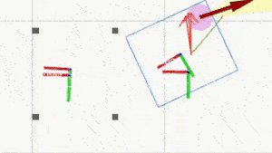
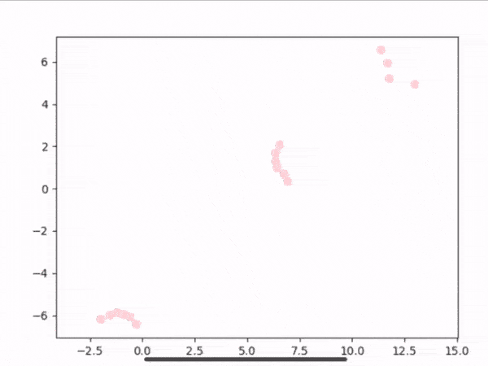

Share my robotic demos with all! Add star🌟 to this repo if you like it

## Control
### anti-cogging


Anti-Cogging demo in ros2.

reference:

- [odrive_ros2_control](https://github.com/Factor-Robotics/odrive_ros2_control)
- [odriverobotics](https://docs.odriverobotics.com/v/0.5.4/index.html)
- [odrive_diff_drive](https://github.com/zengxiaolei/odrive_diff_drive)


### pure pursuit path tracking with adaptive forwards or backwards heading


reference:

- [Document](https://arxiv.org/abs/1604.07446)


### velocity smoother (1€-Filter)

#### simulation test


```yaml
move_base_vel: original navigation velocity command without obstacle avoidance
cmd_vel: raw navigation velocity command with obstacle avoidance
cmd_vel_filtered: smoothed velocity command with obstacle avoidance
```


#### usecase with an industrial AGV


```yaml
move_base_vel: original navigation velocity command without obstacle avoidance
cmd_vel: smoothed velocity command with obstacle avoidance
```

reference:

- [1€-Filter](https://hal.inria.fr/hal-00670496/document)


### A* planner


reference:

- [Video Reference in bilibili](https://www.bilibili.com/video/av32847834/?redirectFrom=h5)


## SLAM
### localization recovery by apriltag


### SLAM with erased map


### VO

#### realsense D453i mono camera + IMU


reference:

- [VINS-Mono](https://github.com/HKUST-Aerial-Robotics/VINS-Mono)


#### realsense D453i stereo cameras+IMU


reference:

- [VINS-Fusion](https://github.com/HKUST-Aerial-Robotics/VINS-Fusion)


#### ORBSLAM2 with realsense D455 


reference:

[ORBSLAM2](https://github.com/raulmur/ORB_SLAM2)


## Detection
### pallet detection by realsense D435
#### detection demo


#### docking demo


### obstacle detour


The vehicle will wait for some time and then actively detour, if the obstacle does not leave within some time.

reference:

- [Document](http://wiki.ros.org/teb_local_planner)


### Parking Feasibilty Checking and Autonomous Adjustment


### Rotate Parking for Pose Adjustment



### K-Means clustering and 2D circle fitting



    pink o:                    sample points
    grey- purple - yellow o:   clustered points
    red △:                     clustered center
    green --:                  fitted circle from clustered points
    green o:                   circle center


reference:

- [PDF Document of Aalborg Universitet](http://kom.aau.dk/group/04gr742/pdf/kmeans_worksheet.pdf)         


### geometry fitting of obstacles 

#### simulation in stage


```yaml
red: laser data
green: fitted circle
yellow: fitted straight line
blue: robot footprint
visulization: obstacle_detector.msg in RViz
```


#### real case with PEPPERL+FUCHS lidar


```yaml
black: laser data
green: fitted circle & line
samples_per_scan: 4200
scan_frequency: 15
```


reference:

-  [lidar info](https://www.pepperl-fuchs.com/global/en/classid_53.htm?view=productdetails&prodid=86557)


## Behavior 
### behavior engine 
#### behavior creation 


#### behavior execution


#### simulation


reference:

- [FlexBE](http://philserver.bplaced.net/fbe/)  


### state machine(SMACH) usecase


reference: 

- [Document in ROS Wiki](http://wiki.ros.org/smach/UseCase)


## Scheduling
### traffic cross behavior


```yaml
#No need to share information between robots
#Robots move independently of each other
controller_frequency: 2.0Hz （Due to computational load on my own computer）
base_local_planner: teb_local_planner/TebLocalPlannerROS                    
max_vel_x: 1.0m/s
play speed: ×4
```

reference:

- [teb_local_planner](https://github.com/rst-tu-dortmund/teb_local_planner)


### area lock manager


### scheduling and routing for multi agents


```yaml
Scheduling: Manhattan distance
Routing: global path planning based on information sharing & junction behavior of independence      
Clicked point: Navigation tasks are automatically assigned to the nearest and idle robot.   
controller_frequency: 2.0Hz （Due to computational load on my own computer）
base_local_planner: teb_local_planner/TebLocalPlannerROS
max_vel_x: 1.0m/s
play speed: ×4
```


#### run 

git clone this repository  and its dependency package ( [homing_local_planner](https://github.com/zengxiaolei/homing_local_planner) ) to your ROS (noetic) workspace

```shell
cd ~/your_ros_ws/src
git clone https://github.com/zengxiaolei/robotics_demo.git
cd ..
catkin_make

roslaunch multi_robots_schedule test.launch
```

Note: The launched simulation is slightly different from the local planner and configuration in the gif above. You can play with this algorithm through the rviz user interface.


## Todo

Open source more algorithms and demoscases.


*☕ Buy Me a Coffee by AliPay*


